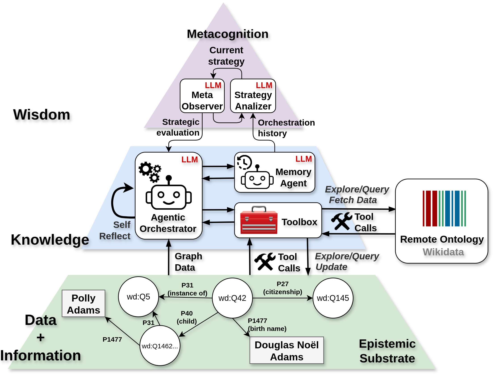

# RoboData - Ontology Explorer



## About This Project

[Anonymized]

---

An interactive ontology explorer that uses LLM agents to navigate and query Wikidata entities, with a graphical visualization interface and comprehensive testing infrastructure.

## Project Overview

RoboData provides an intelligent interface for exploring Wikidata ontologies through natural language queries. The system combines LLM agents with specialized tools to enable intuitive navigation of knowledge graphs, entity relationships, and semantic hierarchies.

## Project Structure

```
RoboData/
├── backend/
│   ├── core/
│   │   ├── agents/
│   │   │   ├── __init__.py
│   │   │   ├── agent.py          # Abstract base agent
│   │   │   └── gemini.py         # Gemini implementation with tool calling
│   │   ├── memory/
│   │   │   ├── __init__.py
│   │   │   └── memory.py         # Conversation and context memory
│   │   ├── orchestrator/
│   │   │   ├── __init__.py
│   │   │   ├── orchestrator.py   # Main query orchestrator
│   │   │   └── multi_stage/
│   │   │       └── __init__.py   # Multi-stage query planning
│   │   ├── toolbox/
│   │   │   ├── __init__.py
│   │   │   ├── toolbox.py        # Dynamic tool management system
│   │   │   ├── graph/
│   │   │   │   ├── __init__.py
│   │   │   │   └── graph_tools.py # Neo4j graph database tools
│   │   │   └── wikidata/
│   │   │       ├── __init__.py
│   │   │       ├── base.py           # High-level Wikidata functions
│   │   │       ├── datamodel.py      # Pydantic data models
│   │   │       ├── wikidata_api.py   # REST API wrapper
│   │   │       ├── wikidata_kif_api.py # KIF API implementation
│   │   │       ├── queries.py        # SPARQL query tools
│   │   │       └── exploration.py    # Graph exploration tools
│   │   └── knowledge_base/
│   │       ├── __init__.py
│   │       ├── graph.py          # Neo4j database abstraction
│   │       ├── schema.py         # Local graph data models (Node, Edge, Graph)
│   │       └── interfaces/
│   │           ├── __init__.py
│   │           └── neo4j_interface.py # Neo4j connection interface
│   ├── test/
│   │   ├── __init__.py
│   │   ├── test_tools.py         # Comprehensive tool tests
│   │   ├── test_datamodel.py     # Data model validation tests
│   │   ├── test_base_tools.py    # Base function integration tests
│   │   ├── test_api.py           # REST API tests
│   │   ├── test_api_kif.py       # KIF API tests
│   │   └── run_tests.py          # Test runner with real API calls
│   ├── settings.py               # Configuration management
│   └── main.py                   # Interactive terminal application
├── config.yaml                   # Configuration file
├── requirements.txt               # Python dependencies
├── frontend/                     # React frontend (future)
└── README.md
```

## 🚀 Features

### Core Capabilities
- **Natural Language Queries**: Ask questions about Wikidata entities in plain English
- **Dynamic Tool System**: Extensible architecture with automatic tool registration
- **Multiple API Backends**: Support for both REST API and KIF (Knowledge Integration Framework)
- **Graph Database Integration**: Neo4j support for local knowledge graph storage
- **Comprehensive Testing**: Real API integration tests with validation

### Query Types
- Entity exploration and detailed information retrieval
- Subclass/superclass hierarchy navigation
- Instance finding and classification
- Path finding between entities
- Local graph construction around entities
- Custom SPARQL query execution

### Data Models
- Strongly typed Pydantic models for all Wikidata entities
- Automatic conversion between API formats and internal models
- Entity reference detection and validation
- Support for multilingual labels and descriptions

## 🛠️ Installation

1. **Clone the repository**:
   ```bash
   git clone <repository-url>
   cd RoboData
   ```

2. **Install dependencies**:
   ```bash
   pip install -r requirements.txt
   ```

3. **Set up API keys**:
   ```bash
   export GEMINI_API_KEY="your-gemini-api-key"
   # OR create a .env file with:
   # GEMINI_API_KEY=your-gemini-api-key
   ```

4. **Set up Neo4j** (for graph database features):
   
   **Install Neo4j on your system:**
   Following the [official install guide](https://neo4j.com/docs/operations-manual/current/installation/linux/)
   
   **Verify Installation:**
   Check if Neo4j is running
   ```
   sudo systemctl status neo4j
   ```

   Access Neo4j Browser (optional)
   Open http://localhost:7474 in your browser
   Login with username: neo4j, password: neo4j
   
   You will be prompted to change the password

   Test connection with cypher-shell
   ```
   cypher-shell -u neo4j -p robodata123
   ```
   
   **Update config.yaml with your Neo4j credentials:**
   ```yaml
   neo4j:
     uri: "bolt://localhost:7687"
     username: "neo4j"
     password: "robodata123"
     database: "neo4j"
   ```

5. **Configure settings** (optional):
   Edit `config.yaml` to customize behavior

## 🎯 Usage

### Interactive Terminal

Start the interactive terminal session:

```bash
cd backend
python -m core.orchestrator.multi_stage.multi_stage_orchestrator
```

### Using the Local SLM (eaddario/Watt-Tool-8B-GGUF)

To test the performance of the local SLM, follow these steps:

1.  **Download the GGUF model**:
    You can download the quantized model from [Hugging Face](https://huggingface.co/eaddario/Watt-Tool-8B-GGUF). Choose a quantization level that suits your hardware.

2.  **Install `llama-cpp-python`**:
    This library is needed to run the GGUF model and serve it through an OpenAI-compatible API.
    ```bash
    pip install llama-cpp-python
    ```
    For GPU acceleration, refer to the `llama-cpp-python` documentation for installation with specific backends (e.g., cuBLAS for NVIDIA).

3.  **Start the local server**:
    Run the following command, replacing `<path_to_gguf_model>` with the path to your downloaded model file.
    ```bash
    python3 -m llama_cpp.server --model <path_to_gguf_model> --chat_format functionary
    ```
    The `functionary` chat format is crucial for tool-calling capabilities.

4.  **Configure the Orchestrator**:
    In `backend/core/orchestrator/multi_stage/multi_stage_orchestrator.py`, set the `USE_SLM` flag to `True`:
    ```python
    # ... inside if __name__ == "__main__":
    USE_SLM = True
    ```

5.  **Run the application**:
    With the local server running, start the orchestrator as usual:
    ```bash
    cd backend
    python -m core.orchestrator.multi_stage.multi_stage_orchestrator
    ```
    The orchestrator will now use the local `WatToolSLMAgent` to process queries.

### Available Commands

- `help` - Show help information and query examples
- `tools` - List all available tools with descriptions
- `settings` - Show current configuration
- `clear` - Clear conversation history
- `exit`/`quit` - Exit the application

## 🔧 Tools

The system includes comprehensive tool sets for different domains:

### Graph Tools
- **AddNodeTool**: Adds nodes to the graph database.
- **AddEdgeTool**: Adds edges to the graph database.
- **GetNodeTool**: Retrieves a node from the graph database by ID.
- **GetEdgeTool**: Retrieves an edge from the graph database.
- **RemoveNodeTool**: Removes a node from the graph database.
- **RemoveEdgeTool**: Removes an edge from the graph database.
- **FindNodesTool**: Finds nodes of a given type in the graph database.
- **FindEdgesTool**: Finds edges of a given type in the graph database.
- **GetNeighborsTool**: Retrieves neighboring nodes of a given node.
- **GetSubgraphTool**: Retrieves a subgraph around a given node.
- **GetGraphStatsTool**: Retrieves statistics about the graph.
- **CypherQueryTool**: Executes a Cypher query on the graph database.

### Wikidata Tools

#### Base Tools
- **GetEntityInfoTool**: Gets basic information about a Wikidata entity.
- **GetEntityPropertiesTool**: Gets all properties of a Wikidata entity.
- **GetPropertyInfoTool**: Gets information about a Wikidata property.
- **SearchEntitiesTool**: Searches for Wikidata entities by a text query.

#### Query Tools
- **SPARQLQueryTool**: Executes a raw SPARQL query.
- **SubclassQueryTool**: Finds subclasses of a Wikidata entity.
- **SuperclassQueryTool**: Finds superclasses of a Wikidata entity.
- **InstanceQueryTool**: Finds all instances of a given class.
- **InstanceOfQueryTool**: Finds what classes a given entity is an instance of.
- **PropertyQueryTool**: Finds entities that have a specific property with a specific value.

#### Exploration Tools
- **NeighborsExplorationTool**: Explores the neighbors and relationships of an entity.
- **LocalGraphTool**: Builds a local graph around a central entity.

## ⚙️ Configuration

Configure the system via `config.yaml`:

```yaml
llm:
  provider: "gemini"
  model: "gemini-pro"
  temperature: 0.7
  api_key: null  # Set via environment variable

wikidata:
  timeout: 30
  max_results: 100
  default_language: "en"

toolbox:
  auto_register_wikidata_tools: true
  max_tool_execution_time: 60

interactive:
  show_tool_calls: true
  show_intermediate_steps: true
  max_history_length: 100
```

## 🏗️ Architecture

### Core Components

1. **BaseAgent**: Abstract interface for LLM agents with tool calling capabilities
2. **Toolbox**: Dynamic tool registration and management with validation
3. **Data Models**: Strongly typed Pydantic models for all Wikidata structures
4. **API Abstraction**: Multiple backend support (REST, KIF) with consistent interface
5. **Settings Management**: YAML configuration with environment variable overrides


### API Backends

- **REST API**: Using the `wikidata` Python library for standard operations
- **KIF API**: IBM's Knowledge Integration Framework for advanced queries
- **SPARQL**: Direct SPARQL endpoint access for custom queries

## 📊 Data Models

The project employs two distinct types of data models: one for handling data from the remote Wikidata source and another for representing the local knowledge graph.

### Wikidata Data Models

The system uses strongly typed Pydantic models for all Wikidata structures, ensuring data consistency and validation when interacting with Wikidata APIs.

```python
# Example entity model from Wikidata
WikidataEntity(
    id="Q42",
    label="Douglas Adams",
    description="British author and humorist",
    aliases=["Douglas Noel Adams", "DNA"],
    statements={
        "P31": [WikidataStatement(...)],  # instance of
        "P106": [WikidataStatement(...)]  # occupation
    }
)
```

Models include:
- **WikidataEntity**: Complete entity representation from Wikidata.
- **WikidataProperty**: Property definitions and constraints from Wikidata.
- **WikidataStatement**: Individual claims with qualifiers.
- **SearchResult**: Search result metadata.

### Knowledge Graph Abstraction

For building, visualizing, and storing local graphs (e.g., in Neo4j), a simpler, more generic graph abstraction is used. This decouples the local graph representation from the complex structure of the Wikidata source.

```python
# Example local graph node and edge
Node(
    id="Q42",
    type="entity",
    label="Douglas Adams",
    description="British author and humorist"
)

Edge(
    source_id="Q42",
    target_id="Q5",
    type="P31", # instance of
    label="instance of"
)
```

This abstraction includes:
- **Node**: Represents any entity in the local graph.
- **Edge**: Represents a relationship between two nodes.
- **Graph**: A container for nodes and edges, built on `networkx`, with methods for manipulation and export (e.g., to JSON or RDF).

## 🤝 Contributing

1. Fork the repository
2. Create a feature branch
3. Add comprehensive tests for new functionality
4. Ensure all tests pass with real API calls
5. Update documentation as needed
6. Submit a pull request

### Development Guidelines
- Follow the existing tool pattern for new tools
- Add both unit and integration tests
- Use type hints and Pydantic models
- Include docstrings with examples

## 📚 Documentation

- **Tool Development**: See `core/toolbox/toolbox.py` for the tool interface
- **Data Models**: Check `core/toolbox/wikidata/datamodel.py` for schemas
- **API Usage**: Examples in test files demonstrate real usage patterns
- **Configuration**: All settings are documented in `settings.py`

## 📄 License

This project is licensed under the MIT License.

## 🙏 Acknowledgments

[Anonymized]
